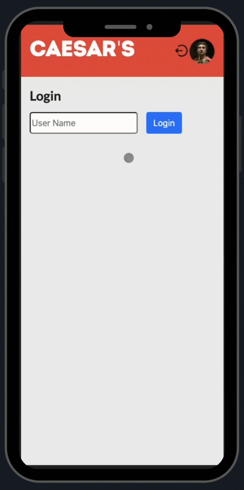

# Caesar's

Food ordering mobile app for Caesar's, a caesar bar. Customers can log in and order their favourite items. A restaurant user can check and confirm the order. Once confirmed, the customer receives an SMS notification from the restaurant.  
Front-end:  HTML, CSS, SASS, JS, jQuery.  
Back-end: Node, Express, SQL.

Group project with [@hansori01](https://github.com/hansori01), [@luke-yin](https://github.com/luke-yin), [@BettyHoPro](https://github.com/BettyHoPro). 
Assignment for [Lighthouse Labs](https://www.lighthouselabs.ca/)

### My contribution
Worked on building the back end with Express, creating all the routes, and on the logic for the ejs files.

## How it works

  

## Setup
1. Fork this repository, then clone your fork of this repository.
2. Install dependencies: `npm i`
3. Run the server: `npm run local`
4. Visit `http://localhost:8080/`
5. To log in as a customer user, username: Judit. To log as restaurant user: Sori.

